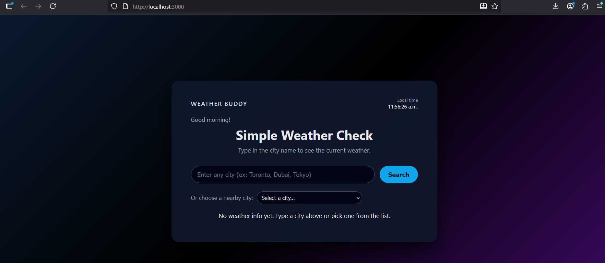
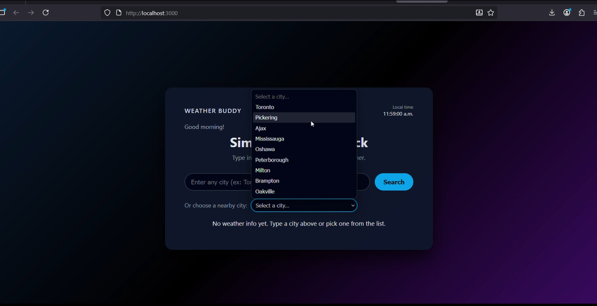

## Weather Buddy — React Weather Dashboard

A small weather dashboard built with React that lets users check the current weather and a 5-day forecast for any city.

It also includes a live clock, basic weather alerts (storm/snow warnings), preset GTA city options, and a simple animated UI.

## API Used

This project uses the OpenWeatherMap API:

- Current Weather Endpoint
https://api.openweathermap.org/data/2.5/weather?q=Toronto&appid=39e1613133dedd8456ebdb97c55edbf9&units=metric

- 5-Day / 3-Hour Forecast
https://api.openweathermap.org/data/2.5/forecast?q=Toronto&appid=39e1613133dedd8456ebdb97c55edbf9&units=metric

## Screenshots

### Main Screen

### 5-Day Forecast

### Drop Down

### Postman 

